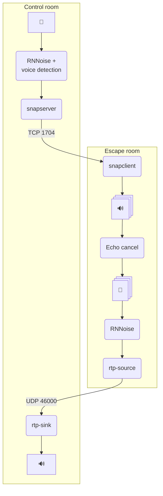

# Alloria

Escape game sound system

## Design

```mermaid
graph
    mic-r["🎤"]
    mic-s["🎤"]
    speak-r["🔊"]
    speak-s["🔊"]
    noise-r("RNNoise + <br>voice detection")
    noise-s("RNNoise")
    source("rtp-source")
    sink("rtp-sink")
    server("snapserver")
    client("snapclient")
    echo("Echo cancel")

    mic-s@{ shape: procs}
    speak-s@{ shape: procs}

    source -- UDP 46000 --> sink
    server -- TCP 1704 --> client

    subgraph Escape room
        client --> speak-s --> echo -->
        mic-s --> noise-s --> source
    end

    subgraph Control room
        sink --> speak-r
        mic-r --> noise-r --> server
    end
```
