# Alloria

Escape game sound system

## Pipewire

```mermaid
graph
    mic-r["🎤"]
    mic-s["🎤"]
    speak-r["🔊"]
    speak-s["🔊"]
    noise-r["RNNoise + <br>voice detection"]
    noise-s["RNNoise"]
    source-e["rtp-source-e-i"]
    sink-r["rtp-sink-r-i"]
    source-r["rtp-source-r-i"]
    sink-e["rtp-sink-e-i"]
    echo["Echo cancel"]

    mic-s@{ shape: procs}
    speak-s@{ shape: procs}
    source-r@{ shape: procs}
    sink-r@{ shape: procs}

    source-e -- UDP 46000+i --> sink-r
    source-r -- UDP 46000+i --> sink-e

    subgraph "Escape room N°i"
        sink-e --> speak-s --> echo -->
        mic-s --> noise-s --> source-e
    end

    subgraph "Control room"
        sink-r --> speak-r
        mic-r --> noise-r --> source-r
    end
```

## MQTT

Volume can be controlled from MQTT:
- `alloria/sink` / int: set speaker volume to `$message` (base 100)
- `alloria/source` / int: set microphone volume to `$message` (base 100)
- `alloria/sink/mute` / str: mute speaker if and only if `$message == $instance`
- `alloria/source/mute` / str: mute microphone if and only if `$message == $instance`
- `alloria/sink/$instance` / int: set `$instance` speaker volume to `$message` (base 100)
- `alloria/source/$instance` / int: set `$instance` microphone volume to `$message` (base 100)
- `alloria/sink/mute/$instance` bool: mute `$instance` speaker volume ("0" or "1")
- `alloria/source/mute/$instance` bool: mute `$instance` microphone volume ("0" or "1")
